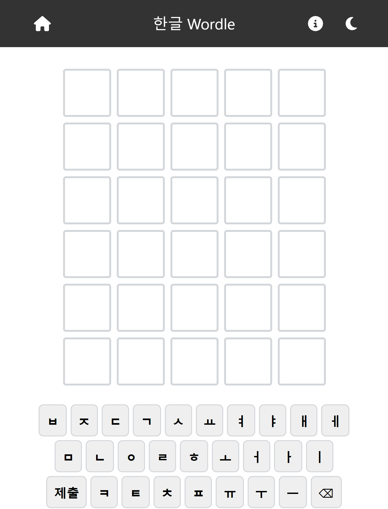
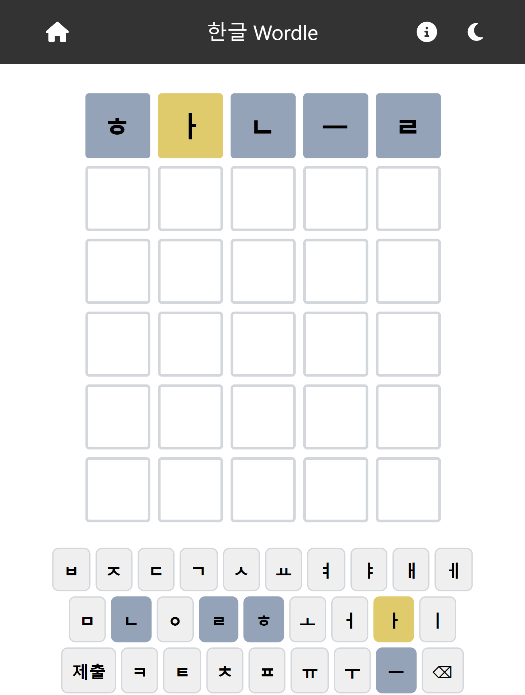
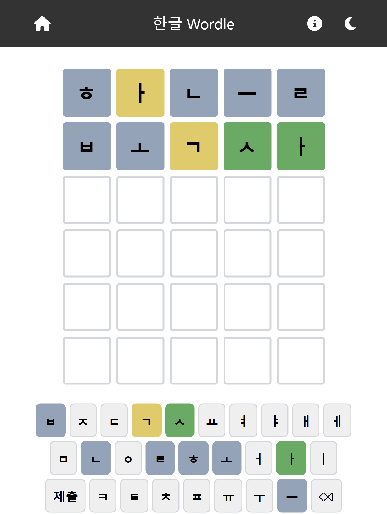
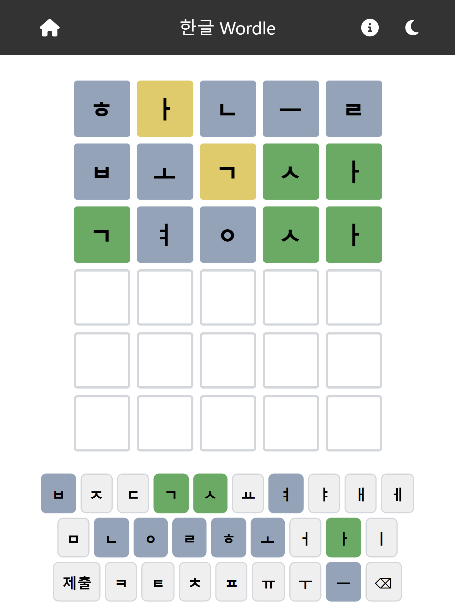
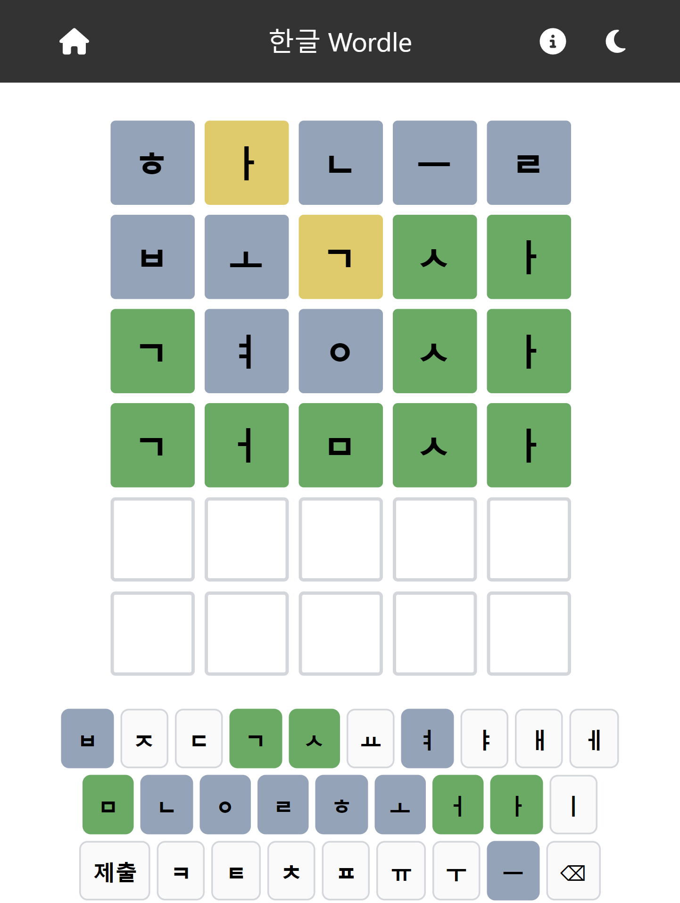

# 한글 Korean Wordle

**[게임 시작하기](https://hwahyeon.github.io/reactjs-wordle-kor/)**
  
  
## 개요
The New York Times에서 제공하는 영문 게임 [Wordle](https://www.nytimes.com/games/wordle/index.html)을 한국어 버젼으로 만들었습니다. 하루에 한 문제만 제공되며, 매일 00시에 정답은 변경됩니다.

### 하는 방법
- 6번의 시도 안에 오늘의 **단어**를 알아내는 것이 목적입니다.
- 색상은 정답의 단서가 됩니다.
  - 타일이 초록색이라면, 표시된 글자는 오늘의 단어에 존재하며, 정확한 위치에 있다는 뜻입니다.
  - 타일이 노란색이라면, 표시된 글자는 오늘의 단어에 존재하나, 정확한 위치에 있지는 않다는 뜻입니다.
  - 타일이 연회색이라면, 표시된 글자는 오늘의 단어에 존재하지 않는다는 뜻입니다.
- 게임은 풀어쓰기로 진행됩니다. 아래는 예시입니다.
  - `하늘`은 `ㅎㅏㄴㅡㄹ`
  - `너울`은 `ㄴㅓㅇㅜㄹ`
- 겹자모는 두 칸을 사용합니다. 아래는 예시입니다.
  - `꼬마`는 `ㄱㄱㅗㅁㅏ`
  - `과거`는 `ㄱㅗㅏㄱㅓ`
- 오늘의 단어는 **명사**입니다.

### 예시

  
처음 시작화면입니다. 지금은 아무 단서가 없으니 아무 단어나 써볼까요? `하늘`이 좋겠군요.
  

타일의 색이 변경되면서 여러 단서가 나왔어요. `오늘의 단어`는 `ㅎ`,`ㄴ`,`ㅡ`,`ㄹ` 를 포함하지 않고, `ㅏ`를 포함하고 있군요. 그럼 `복사`를 써보겠습니다. `ㅎ`,`ㄴ`,`ㅡ`,`ㄹ`를 포함하지 않고, `ㅏ`를 포함한 단어 중 하나니까요.
  

정답에 가까워지고 있습니다. `오늘의 단어`는 `사`로 끝나는 단어였군요. 음, `경사`로 한 번 시도해보죠.

정답에 아주 근접했습니다. 두 타일만 맞추면 됩니다. 혹시 답은 `검사`가 아닐까요?

`오늘의 단어`는 `검사`였군요!

## 참고
### [Dataset repository](https://github.com/hwahyeon/py-wordle-kor-dataset)
- [우리말샘](https://opendict.korean.go.kr/) 사전
- [국립국어연구원](https://www.korean.go.kr/front/etcData/etcDataView.do?mn_id=46&etc_seq=71) 한국어 학습용 어휘 목록
